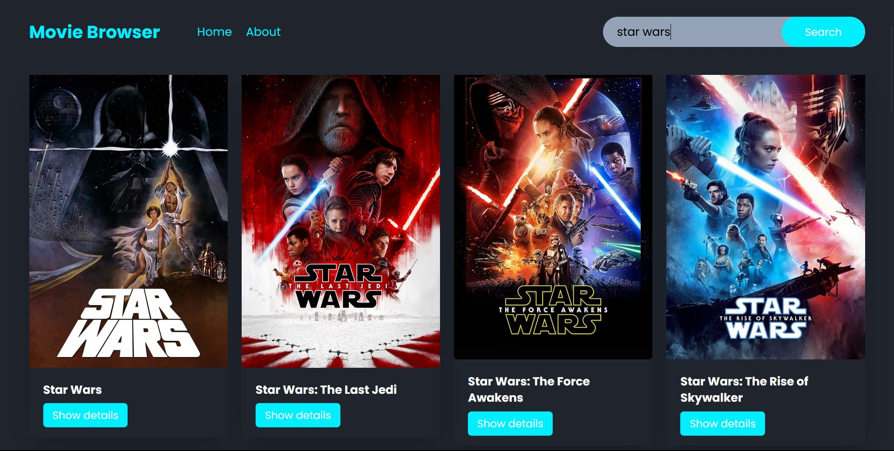

---

# Getting Started with Movie Browser

Movie Browser is a comprehensive web application designed to make your movie discovery experience seamless and enjoyable. Imagine a world where you can effortlessly search for any movie, series, or anime in existence and instantly access detailed information about it.

> Make sure to read our [contributing guidelines](https://github.com/EmmyRecent/movie-browser/blob/main/CONTRIBUTING.md)

### 1\. Clone this Repository

```bash
git clone https://github.com/EmmyRecent/movie-browser.git
```

### 2\. Navigate to the directory

```bash
cd movie-browser
```

## Available Scripts

In the project directory, you can run:

```bash
npm start
```

Runs the app in the development mode.\
Open [http://localhost:3000](http://localhost:3000) to view it in your browser.
